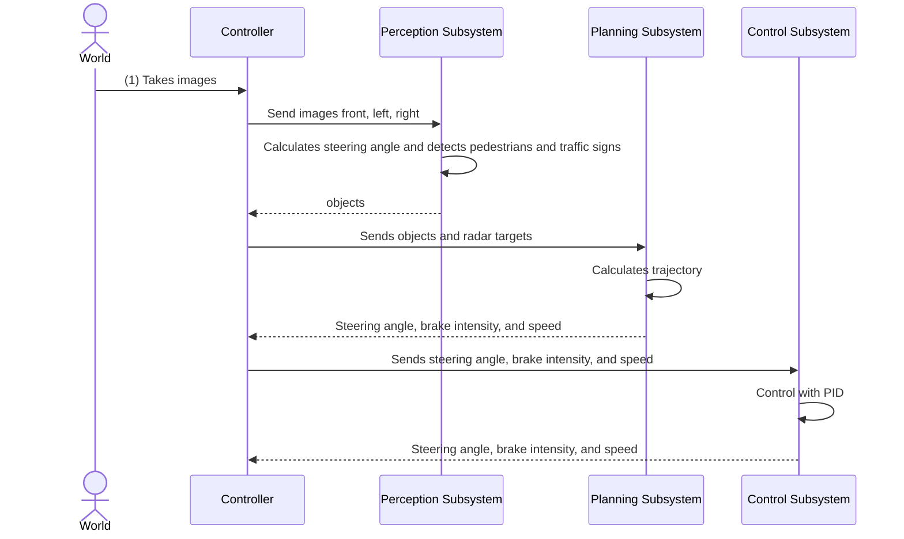

# Webots Lanes Dataset

The csv files contain the next columns

 * imageFrontId : the front camera image
 * imageLeftId : the left camera image
 * imageRightId : the right camera image
 * steeringAngle : the general steering angle
 * leftSteeringAngle : the steering angle applied to the left wheel according to the ackerman geometry
 * rightSteeringAngle :  the steering angle applied to the right wheel according to the ackerman geometry
 * cruisingSpeed : the general speed of the vehicle
 * brakeIntensity : the brake intensity of the vehicle

# Project Modules

 * Perception Subsystem
 * Planning Subsystem
 * Control Subsystem

taken from [autonomous vehicle](https://sawhney-prateek97.medium.com/autonomous-vehicle-architecture-b802f30283fa)

# Interaction Between Modules

